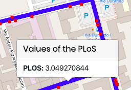

 
   
#  Enhanced Pedestrian Level of Service (PLoS):
Data Collection, Processing and Visualization of the result of Plos computation of an area in Milan (Milano Nord Bovisa Station). 

## What is PloS?
The Pedestrian LOS Model is aimed at evaluating walking conditions on road and street corridors in urban environment.
PLoS is a measure of comfort and safety of existing and planned walkways. It allows objective and sound evaluations of pedestrians’ perception and response to roadway environment.

## Project
Web GIS about a QGIS project of PLOS computation of an area in Milan (Milano Nord Bovisa Station) using HTML5, CCS and JavaScript.

<kbd></kbd>
 
 

### Implementation: Steps

1- **Collect Data**: using [EpiCollect](https://five.epicollect.net) we collect measurament of data for PLoS computation in a field survey and download them in .csv format; 
 
 
 
 
 
 
 
 
 
2-**Data Processing**: we process date using QGIS, with operations such as buffer, intersection and attribute table manipulation in order to associate each point value to the corresponding road network and to compute the PLoSs index for each segments; 
 
 
 
 
 
 
 

3-**WebGIS develop**: we develop a [website](https://github.com/bresc19/PLOS_Milan/blob/master/index.html) in order to show the the result of the PLoSs index computation

 
 
 
 
 
 

### Web Site Implementation: tool used
- 
- 
- 

      

## Authors

* **Bresciani Matteo** 
* **Orsenigo Andrea**
* **Gabriele D’Ascoli**
* **Metehan Ergen**
